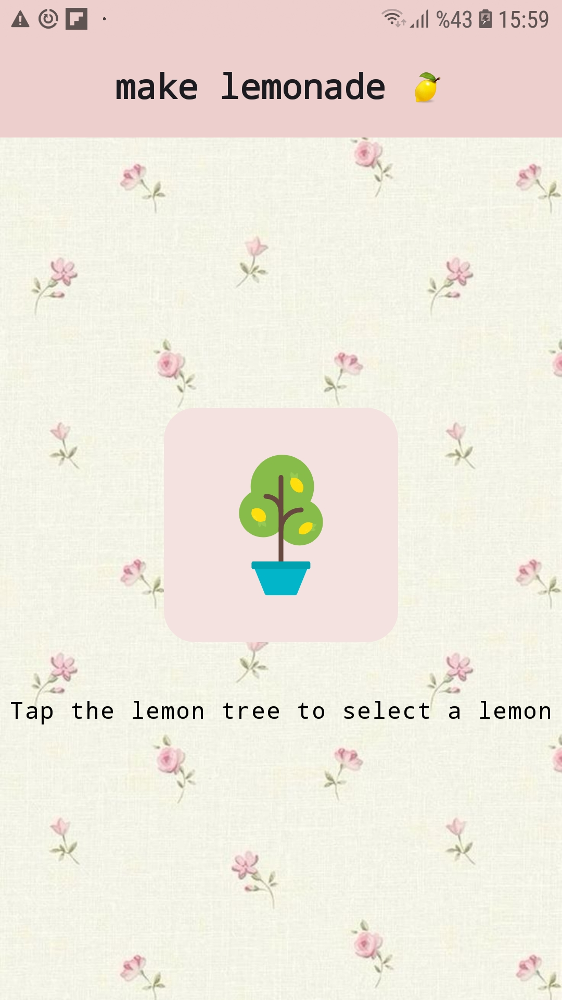
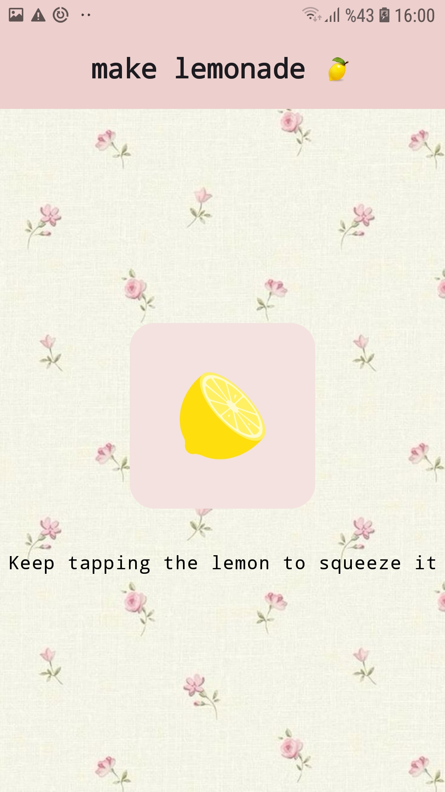
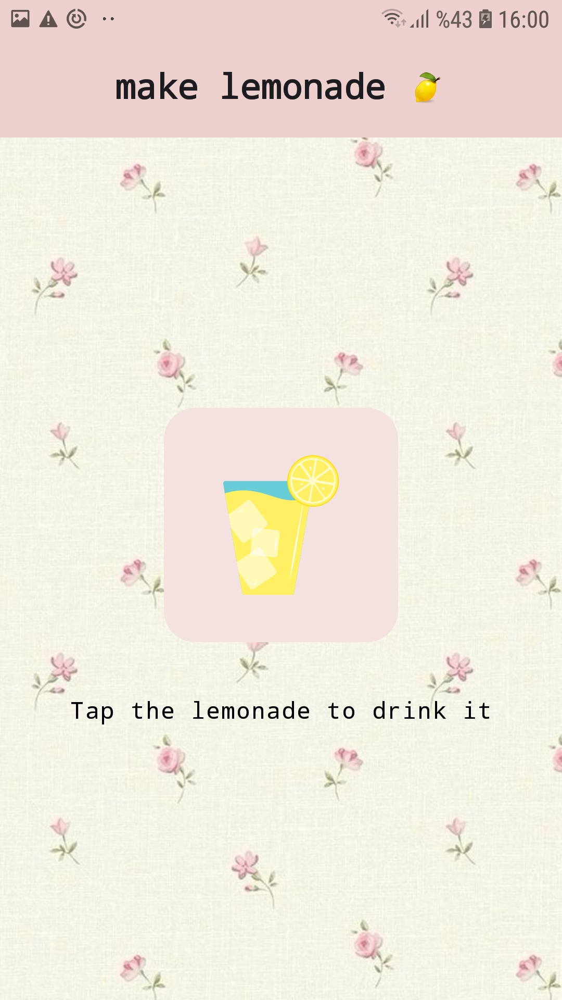
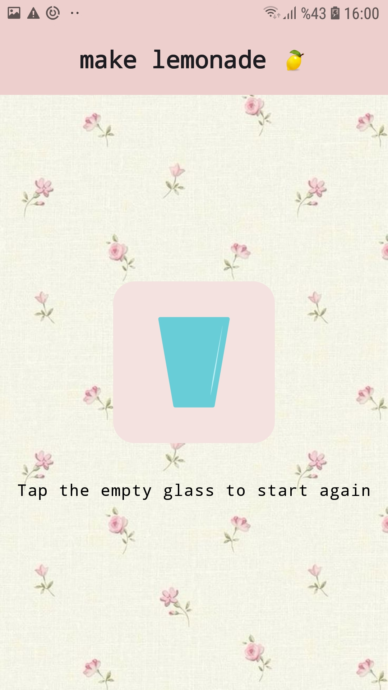

# Lemonade App

This project is a part of the  [Jetpack Compose Android Developers Course](https://developer.android.com/codelabs/basic-android-kotlin-compose-button-click-practice-problem?continue=https%3A%2F%2Fdeveloper.android.com%2Fcourses%2Fpathways%2Fandroid-basics-compose-unit-2-pathway-2%23codelab-https%3A%2F%2Fdeveloper.android.com%2Fcodelabs%2Fbasic-android-kotlin-compose-button-click-practice-problem#0) developed by Android Developers. It is a simple and interactive app that allows users to follow the process of making lemonade through a series of steps: selecting a lemon, squeezing it, drinking lemonade, and restarting the process.

## Features

- **Step 1:** Select a lemon from a lemon tree.
- **Step 2:** Squeeze the selected lemon.
- **Step 3:** Drink the lemonade.
- **Step 4:** Restart the process with an empty glass.

The app is built using **Jetpack Compose** and follows modern Android development practices with Material3.

## Screenshots

The app has four stages, and here are the screenshots for each step:

## Step 1: Select Lemon
 

## Step 2: Squeeze Lemon
 

## Step 3: Drink Lemonade
 

## Step 4: Empty Glass and Restart
 

## Setup

To run the app, you will need Android Studio with the following:

- Android Studio (latest version)
- Jetpack Compose enabled
- A physical or virtual Android device running Android 5.0 (Lollipop) or above.

### Steps to Run

1. Clone the repository:
git clone https://github.com/yourusername/lemonade-app.git

2. Open the project in Android Studio.

3. Run the project on an emulator or physical device.

## Technologies Used

- **Jetpack Compose** - A modern toolkit for building native UI in Android.
- **Material3** - A Material Design library for modern UI elements.
- **Kotlin** - The primary programming language for Android development.

